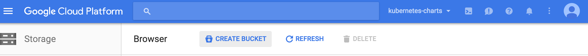
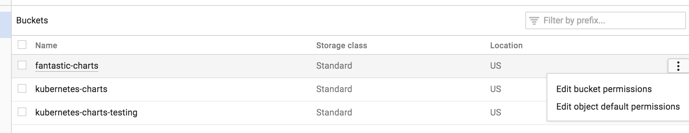
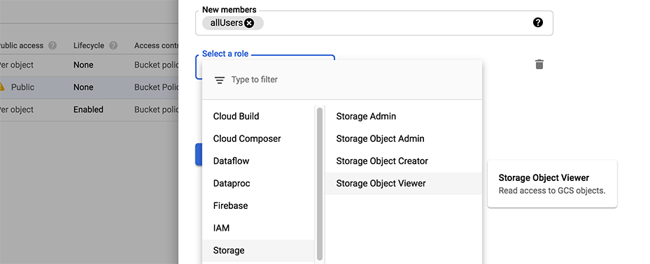
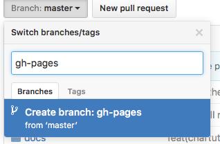
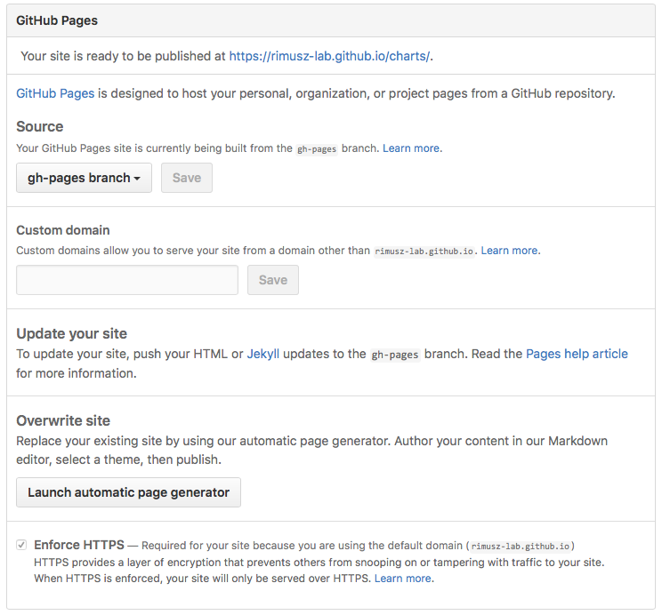

# The Chart Repository Guide

This section explains how to create and work with Helm chart repositories. At a
high level, a chart repository is a location where packaged charts can be
stored and shared.

The official chart repository is maintained by the
[Kubernetes Charts](https://github.com/kubernetes/charts), and we welcome
participation. But Helm also makes it easy to create and run your own chart
repository. This guide explains how to do so.

## Prerequisites

* Go through the [Quickstart](quickstart.md) Guide
* Read through the [Charts](charts.md) document

## Create a chart repository

A _chart repository_ is an HTTP server that houses an `index.yaml` file and
optionally some packaged charts.  When you're ready to share your charts, the
preferred way to do so is by uploading them to a chart repository.

**Note:** For Helm 2.0.0, chart repositories do not have any intrinsic
authentication. There is an [issue tracking progress](https://github.com/kubernetes/helm/issues/1038)
in GitHub.

Because a chart repository can be any HTTP server that can serve YAML and tar
files and can answer GET requests, you have a plethora of options when it comes
down to hosting your own chart repository. For example, you can use a Google
Cloud Storage (GCS) bucket, Amazon S3 bucket, Github Pages, or even create your
own web server.

### The chart repository structure

A chart repository consists of packaged charts and a special file called
`index.yaml` which contains an index of all of the charts in the repository.
Frequently, the charts that `index.yaml` describes are also hosted on the same
server, as are the [provenance files](provenance.md).

For example, the layout of the repository `https://example.com/charts` might
look like this:

```
charts/
  |
  |- index.yaml
  |
  |- alpine-0.1.2.tgz
  |
  |- alpine-0.1.2.tgz.prov
```

In this case, the index file would contain information about one chart, the Alpine
chart, and provide the download URL `https://example.com/charts/alpine-0.1.2.tgz`
for that chart.

It is not required that a chart package be located on the same server as the
`index.yaml` file. However, doing so is often the easiest.

### The index file

The index file is a yaml file called `index.yaml`. It
contains some metadata about the package, including the contents of a
chart's `Chart.yaml` file. A valid chart repository must have an index file. The
index file contains information about each chart in the chart repository. The
`helm repo index` command will generate an index file based on a given local
directory that contains packaged charts.

This is an example of an index file:

```
apiVersion: v1
entries:
  alpine:
    - created: 2016-10-06T16:23:20.499814565-06:00
      description: Deploy a basic Alpine Linux pod
      digest: 99c76e403d752c84ead610644d4b1c2f2b453a74b921f422b9dcb8a7c8b559cd
      home: https://k8s.io/helm
      name: alpine
      sources:
      - https://github.com/kubernetes/helm
      urls:
      - https://technosophos.github.io/tscharts/alpine-0.2.0.tgz
      version: 0.2.0
    - created: 2016-10-06T16:23:20.499543808-06:00
      description: Deploy a basic Alpine Linux pod
      digest: 515c58e5f79d8b2913a10cb400ebb6fa9c77fe813287afbacf1a0b897cd78727
      home: https://k8s.io/helm
      name: alpine
      sources:
      - https://github.com/kubernetes/helm
      urls:
      - https://technosophos.github.io/tscharts/alpine-0.1.0.tgz
      version: 0.1.0
  nginx:
    - created: 2016-10-06T16:23:20.499543808-06:00
      description: Create a basic nginx HTTP server
      digest: aaff4545f79d8b2913a10cb400ebb6fa9c77fe813287afbacf1a0b897cdffffff
      home: https://k8s.io/helm
      name: nginx
      sources:
      - https://github.com/kubernetes/charts
      urls:
      - https://technosophos.github.io/tscharts/nginx-1.1.0.tgz
      version: 1.1.0
generated: 2016-10-06T16:23:20.499029981-06:00
```

A generated index and packages can be served from a basic webserver. You can test
things out locally with the `helm serve` command, which starts a local server.

```console
$ helm serve --repo-path ./charts
Regenerating index. This may take a moment.
Now serving you on 127.0.0.1:8879
```

The above starts a local webserver, serving the charts it finds in `./charts`. The
serve command will automatically generate an `index.yaml` file for you during
startup.

## Hosting Chart Repositories

This part shows several ways to serve a chart repository.

### Google Cloud Storage

The first step is to **create your GCS bucket**. We'll call ours
`fantastic-charts`.



Next, make your bucket public by **editing the bucket permissions**.



Insert this line item to **make your bucket public**:



Congratulations, now you have an empty GCS bucket ready to serve charts!

You may upload your chart repository using the Google Cloud Storage command line
tool, or using the GCS web UI. This is the technique the official Kubernetes
Charts repository hosts its charts, so you may want to take a
[peek at that project](https://github.com/kubernetes/charts) if you get stuck.

**Note:** A public GCS bucket can be accessed via simple HTTPS at this address
`https://bucket-name.storage.googleapis.com/`.

### JFrog Artifactory

You can also set up chart repositories using JFrog Artifactory.
Read more about chart repositories with JFrog Artifactory [here](https://www.jfrog.com/confluence/display/RTF/Helm+Chart+Repositories)

### Github Pages example

In a similar way you can create charts repository using GitHub Pages.

GitHub allows you to serve static web pages in two different ways:

- By configuring a project to serve the contents of its `docs/` directory
- By configuring a project to serve a particular branch

We'll take the second approach, though the first is just as easy.

The first step will be to **create your gh-pages branch**.  You can do that
locally as.

```console
$ git checkout -b gh-pages
```

Or via web browser using **Branch** button on your Github repository:



Next, you'll want to make sure your **gh-pages branch** is set as Github Pages,
click on your repo **Settings** and scroll down to **Github pages** section and
set as per below:



By default **Source** usually gets set to **gh-pages branch**. If this is not set by default, then select it.

You can use a **custom domain** there if you wish so.

And check that **Enforce HTTPS** is ticked, so the **HTTPS** will be used when
charts are served.

In such setup you can use **master branch** to store your charts code, and
**gh-pages branch** as charts repository, e.g.:
`https://USERNAME.github.io/REPONAME`. The demonstration [TS Charts](https://github.com/technosophos/tscharts)
repository is accessible at `https://technosophos.github.io/tscharts/`.

### Ordinary web servers

To configure an ordinary web server to serve Helm charts, you merely need to do
the following:

- Put your index and charts in a directory that the server can serve
- Make sure the `index.yaml` file can be accessed with no authentication requirement
- Make sure `yaml` files are served with the correct content type (`text/yaml` or
  `text/x-yaml`)

For example, if you want to serve your charts out of `$WEBROOT/charts`, make sure
there is a `charts/` directory in your web root, and put the index file and
charts inside of that folder.


## Managing Chart Repositories

Now that you have a chart repository, the last part of this guide explains how
to maintain charts in that repository.


### Store charts in your chart repository

Now that you have a chart repository, let's upload a chart and an index file to
the repository.  Charts in a chart repository must be packaged
(`helm package chart-name/`) and versioned correctly (following
[SemVer 2](https://semver.org/) guidelines).

These next steps compose an example workflow, but you are welcome to use
whatever workflow you fancy for storing and updating charts in your chart
repository.

Once you have a packaged chart ready, create a new directory, and move your
packaged chart to that directory.

```console
$ helm package docs/examples/alpine/
$ mkdir fantastic-charts
$ mv alpine-0.1.0.tgz fantastic-charts/
$ helm repo index fantastic-charts --url https://fantastic-charts.storage.googleapis.com
```

The last command takes the path of the local directory that you just created and
the URL of your remote chart repository and composes an `index.yaml` file inside the
given directory path.

Now you can upload the chart and the index file to your chart repository using
a sync tool or manually. If you're using Google Cloud Storage, check out this
[example workflow](chart_repository_sync_example.md) using the gsutil client. For
GitHub, you can simply put the charts in the appropriate destination branch.

### Add new charts to an existing repository

Each time you want to add a new chart to your repository, you must regenerate
the index. The `helm repo index` command will completely rebuild the `index.yaml`
file from scratch, including only the charts that it finds locally.

However, you can use the `--merge` flag to incrementally add new charts to an
existing `index.yaml` file (a great option when working with a remote repository
like GCS). Run `helm repo index --help` to learn more,

Make sure that you upload both the revised `index.yaml` file and the chart. And
if you generated a provenance file, upload that too.

### Share your charts with others

When you're ready to share your charts, simply let someone know what the URL of
your repository is.

From there, they will add the repository to their helm client via the `helm
repo add [NAME] [URL]` command with any name they would like to use to
reference the repository.

```console
$ helm repo add fantastic-charts https://fantastic-charts.storage.googleapis.com
$ helm repo list
fantastic-charts    https://fantastic-charts.storage.googleapis.com
```

If the charts are backed by HTTP basic authentication, you can also supply the
username and password here:

```console
$ helm repo add fantastic-charts https://fantastic-charts.storage.googleapis.com --username my-username --password my-password
$ helm repo list
fantastic-charts    https://fantastic-charts.storage.googleapis.com
```

**Note:** A repository will not be added if it does not contain a valid
`index.yaml`.

After that, your users will be able to search through your charts. After you've updated
the repository, they can use the `helm repo update` command to get the latest
chart information.

*Under the hood, the `helm repo add` and `helm repo update` commands are
fetching the index.yaml file and storing them in the
`$HELM_HOME/repository/cache/` directory. This is where the `helm search`
function finds information about charts.*
