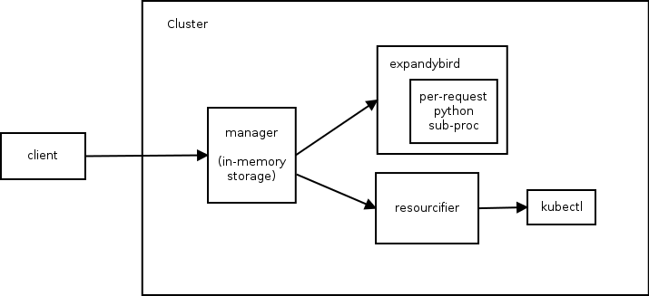

# Deployment Manager Design

## Overview
Deployment Manager is a service which can be run in a Kubernetes cluster that
provides a declarative configuration language to describe Kubernetes
resources and a mechanism for deploying, updating, and deleting configurations.
This document describes the configuration language, object model, and
architecture of the service in detail.

## Configuration Language
The configuration language in Deployment Manager consists of two parts: a
YAML-based language for describing resources, and a templating mechanism for
creating abstract parameterizable types.

A configuration consists of a list of resources in YAML. Resources have three
properties:

* name: the name to use when managing the resource
* type: the type of the resource being managed
* properties: the configuration properties of the resource

An example snippet of a configuration looks like:

```
resources:
- name: my-rc
  type: ReplicationController
  properties:
    metadata:
      name: my-rc
    spec:
      replicas: 1
    ...
- name: my-service
  type: Service
  properties:
    ...
```

### References
Resources can reference values from other resources. The version of Deployment
Manager running in the Google Cloud Platform uses references to understand
dependencies between resources and properly order the operations it performs on
a configuration. This version doesn't yet have this functionality, but will have
it shortly.

A reference follows this syntax: **$(ref.NAME.PATH)**, where _NAME_ is the name
of the resource being referenced, and _PATH_ is a JSON path to the value in the
resource object.

For example:

```
$(ref.my-service.metadata.name)
```

In this case, _my-service_ is the name of the resource, and _metadata.name_ is
the JSON path to the value being referenced.

### Configurable Resources
Configurable resources are the primitive resources that can be configured in
Deployment Manager, including:

* Pod
* ReplicationController
* Service

Deployment Manager processes configurable resources by passing their
configuration properties directly to kubectl on the cluster to create, update,
or delete the resource.

### Templates
Templates are abstract types that can be created using Python or
[Jinja](http://jinja.pocoo.org/). Templates take a set of properties and must
output a valid YAML configuration string. Properties are bound to values when a
template is instantiated in a configuration.

Templates are expanded as a pre-processing step before configurable resources
are processed. They can output configurations containing configurable resources,
or additional nested templates. Nested templates will be processed recursively.

An example of a template in python is:

```
import yaml

def GenerateConfig(context):
  resources = [{
    'name': context.env['name'] + '-service',
    'type': 'Service',
    'properties': {
      'prop1': context.properties['prop1'],
      ...
    }
  }]

  return yaml.dump({'resources': resources})
```

and in Jinja is:

```
resources:
- name: {{ env['name'] }}-service
  type: Service
  properties:
    prop1: {{ properties['prop1'] }}
    ...
```

Templates provide access to several sets of data, which can be used for
parameterizing or further customizing a configuration:

* env: a map of values defined by Deployment Manager, including _deployment_,
  _name_, and _type_
* properties: a map of the key/value pairs passed in the properties section when
  instantiating the template
* imports: a map of import file name to file contents of all imports originally
  specified for the configuration

In Python, this data is available from the _context_ object passed into the
_GenerateConfig_ method.

### Template Schemas
A schema can be provided for a template. The schema describes the template in
more details, including:

* info: more information about the template, including long description and
  title
* required: properties which are required when instantiating the template
* properties: JSON Schema descriptions of each property the template accepts

An example of a template schema is:

```
info:
  title: The Example
  description: A template being used as an example to illustrate concepts.

required:
- prop1

properties:
  prop1:
    description: The first property
    type: string
    default: prop-value
```

Schemas are used by Deployment Manager to validate properties being used during
template instantiation and provide default value semantics on properties.

Schemas must be imported along-side the templates which they describe when
passing configuration to Deployment Manager.

### Instantiating Templates
Templates can be instantiated in the same way that a configurable resource is
used, but must be imported and included as part of the configuration.

```
imports:
- path: example.py

resources:
- name: example
  type: example.py
  properties:
    prop1: prop-value
```

The _imports_ list is not understood by the Deployment Manager service, but is a
directive to client-side tooling to specify what additional files should be
included when passing a configuration to the API.

## API Model
Deployment Manager exposes a set of RESTful collections over HTTP/JSON.

### Deployments
Deployments are the primary resource in the Deployment Manager service. The
inputs to a deployment are:

* name
* targetConfig

When creating a deployment, users pass their YAML configuration, as well as any
import files (templates, datafiles, etc.) in as the _targetConfig_.

Creating, updating and deleting a deployment creates a new manifest for the
deployment, and then processes the new configuration. In the case of deleting a
deployment, the deployment is first updated to an empty manifest containing no
resources, and then is removed from the system.

Deployments are available at the HTTP endpoint:

```
http://manager-service/deployments
```

### Manifests
A manifest is created for a deployment every time it is mutated, including
creation, update, and deletion.

A manifest contains three major pieces of data:

* inputConfig: the original input configuration for the manifest, including YAML
  configuration and imports
* expandedConfig: the final expanded configuration to be used when processing
  resources for the manifest
* layout: the hierarchical structure of the manifest

Manifests are available at the HTTP endpoint:

```
http://manager-service/deployments/<deployment>/manifests
```

#### Expanded Configuration
Given a new _inputConfig_, Deployment Manager expands all template
instantiations recursively until there is a flat set of configurable resources.
This final set is stored as the _expandedConfig_ and is used during resource
processing.

#### Layout
Users can use templates to build a rich, deep hierarchical architecture in their
configuration. Expansion flattens this hierarchy and removes the template
relationships from the configuration to create a format optimized for the process
of instantiating the resources. However, the structural information contained in
the original configuration has many uses, so rather than discard it, Deployment
Manager preserves it in the form of a _layout_.

The _layout_ looks very much like an input configuration. It is a YAML list of
resources, where each resource contains the following information:

* name: name of the resource
* type: type of the resource
* properties: properties of the resource, set only for templates
* resources: sub-resources from expansion, set only for templates

An example layout is:

```
resources:
- name: rs
  type: replicatedservice.py
  propertes:
    replicas: 2
  resources:
  - name: rs-rc
    type: ReplicationController
  - name: rs-service
    type: Service
```

The layout can be used for visualizing the architecture of resources, including
their hierarchical structure and reference relationships.

### Types
The types API provides information about existing types being used the cluster.

It can be used to list all known types that are in use in existing deployments:

```
http://manager-service/types
```

It can be used to list all active instances of a specific type in the cluster:

```
http://manager-service/types/<type>/instances
```

Passing _all_ as the type shows all instances of all types in the cluster. Type
instances include the following information:

* name: name of resource
* type: type of resource
* deployment: name of deployment in which the resource resides
* manifest: name of manifest in which the resource configuration resides
* path: JSON path to the entry for the resource in the manifest layout

## Architecture
The Deployment Manager service is built to run as a service within a Kubernetes
cluster. It has three major components to manage deployments. The following
diagram illustrates the relationships between the components, which are described
in more detail below.



Currently there are two caveats in the design of the service:

* Synchronous API: the API is currently designed to block on all processing for
  a deployment request. In the future, this design will change to an
  asynchronous operation-based mode.
* Non-persistence: the service currently stores all metadata in memory, so will
  lose all knowledge of deployments and their metadata on restart. In the
  future, the service will persist all deployment metadata in the cluster.

### Manager
The **manager** service acts as both the API server and the workflow engine for
processing deployments. The process for a deployment is:

1. Create a new deployment with a manifest containing _inputConfig_ from the
   user request
1. Call out to **expandybird** service to perform expansion on the _inputConfig_
1. Store the resulting _expandedConfig_ and _layout_
1. Call out to **resourcifier** service to perform processing on resources from
   the _expandedConfig_
1. Respond with success or error messages to the original API request

The manager is responsible for all persistence of metadata associated with
deployments, manifests, type instances, and other resources in the Deployment
Manager model.

### Expandybird
The **expandybird** service takes in input configurations, including the YAML
configuration and import files, performs all template expansion, and returns the
resulting flat configuration and layout. It is completely stateless and handles
requests synchronously.

Because templates are Python or Jinja, the actual expansion process is performed
in a sub-process running a Python interpreter. A new sub-process is created for
every request to expandybird.

Currently expansion is not sandboxed, but the intention of templates is to be
reproducable hermetically sealed entities, so future designs may
introduce a sandbox to limit external interaction like network and disk access
during expansion.

### Resourcifier
The **resourcifier** service takes in flat expanded configurations containing
only configurable resources, and makes the respective kubectl calls to process
each resource. It is completely stateless and handles requests synchronously.

Processing may be to create, update, or delete a resource,
depending on the request. The resourcifier handles references, and is the major
workflow engine for resource processing. In the future. it will also handle
dependencies between resources, as described earlier.

The resourcifier service returns either success or error messages encountered
during resource processing.
