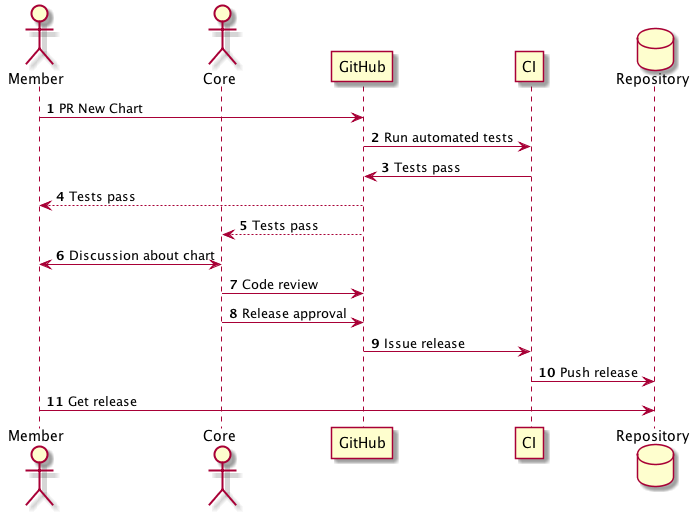
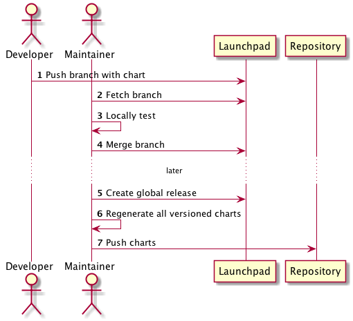
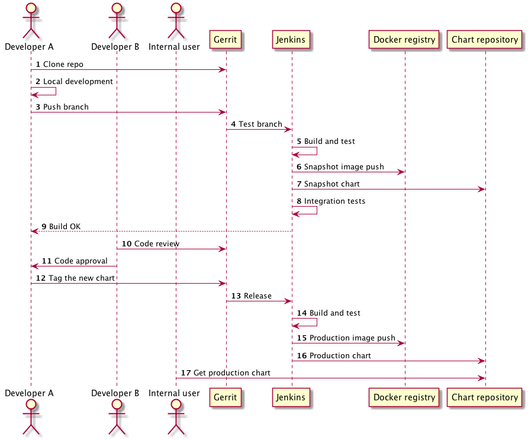

# Helm/DM Developer Workflows

This document explains how Helm/DM can be used under different developer workflows. When we talk about _developer workflow_, we are interested in the process that Helm Chart developers undertake, moving from initially creating a chart to officially releasing a chart.

## tl;dr: The Workflows

Helm and DM expose tools for creating, managing, and deploying charts.
This document outlines those tools, and then provides several possible
workflows.

We envision four workflows, each satisfying different organizational needs.

- Helm Official: The workflow used for contributing to the official Helm charts repository.
- Public Unofficial: A public workflow used by another org
- Private: Non-public repository
- Private Development: Charts without repositories

Each of these workflows can be accommodated by the existing Helm tools and assumptions.

## Workflow Capabilities

- `helm init`: Initialize the Helm client and server. The client initializes itself,
  and can optionally install the DM manifests on a k8s cluster.
- `helm dm install|uninstall|status|target`: Get information about a
  cluster. This is a mix of client and server activities.
- `helm create`: Create a new chart from scratch. This is a client-side action.
- `helm deploy`: Deploy a chart. The client packages the chart. The
  server creates a deployment, expands templates, and then deploys.
- `helm repo add|rm|list`: Manage repositories. The client pushes
  requests to the manager, which manages repositories.
- `helm lint`: Test that a chart conforms to the spec. This is client
  side.
- `helm doctor`: Fix client communication problems.
- `helm get` or `helm deployment get`: Get details about a deployed
  application.
- `helm package`: Package a directory into a chart. Client side.
- `helm release`: Push a package to the repository. Client sends directly
  to repository.
- `helm describe`: Describe a deployment. Processed on the manager.
- `helm list`: List deployments. Processed on the manager
- `helm delete`: Remove a deployment. Processed on the manager.
- `helm search`: Search for available charts matching a given pattern.
  This is processed on the manager.

The remainder of this document is broken into two major sections: The Overview covers the
broad characteristics of the four workflows. The Development Cycle
section covers how the developer cycle plays out for each of the four
workflows.

## An Overview of Four Workflows

This section provides an introduction to the four workflows outline
above, calling out characteristics of each workflow that define it
against other workflows.

### Helm Official

The _Helm Official_ project focuses on maintaining a repository of high-quality production-ready charts. Charts may be contributed by anyone in the broad community, and they are vetted and maintained by the Helm Official core contributors.

Stage | Devel | Review | Release | Store | Use
------|-------|--------|---------|-------|-----
Operations | Create/modify chart | Code review | Sign, version, package  | Store releases | Get, Use
Who? | Developer | Us | Us | Us | Anyone
How? | Dev PR | We review | We release and sign | We upload to managed storage | Chart is public

Characteristics of the Helm Official workflow:

- Source code for charts is maintained in a GitHub repository
- Chart source is linted and tested by automated tools and human beings
- Charts are released by core contributors to the project
- All Charts are made available under the Apache 2 license
- When a chart is released, an official binary distribution is uploaded to the official chart repository in Google Cloud Storage. In addition, Helm Official charts have the following characteristics:
	- They released by community members
	- They are versioned independently (each chart has its own version)
	- They are signed/provenanced by one of the official Helm GPG keys
	- They are made available with no authentication or registration requirements

### Public Unofficial

The Helm project need not be the only repository available to users. Other organizations may wish to host their own repositories, and load whatever charts they so choose.

We attempt to provide flexibility that allows such organizations to build repositories as they see fit, but keep the end user's experience roughly similar.

Stage | Devel | Review | Release | Store | Use
------|-------|--------|---------|-------|-----
Operations | Create/modify chart | Code review | Sign, version, package  | Store releases | Get, Use
Who? | Developer | Org? | Org? | Org | Anyone
How? | Dev Contribution | Org defines this | Org defines this | Org hosts | Chart is public


A public unofficial chart repository is free to structure the development cycle as they see fit.

- We have no opinions about the source control (if any) used for chart development
- We provide `helm release` as a tool for releasing a chart
	- We strongly advise public repository maintainers to use provenance files
	- We strongly advise public repository maintainers to make public keys available 	  to the general public.
- Charts must be stored in one of the supported object storage repositories, including Google Cloud Storage and S3 compatible storage
- Helm/DM provides the following tools for working with such repositories:
    - `helm release` takes local source and builds a chart.
    - `helm repo add|list|rm` allows users to add, list, and remove repositories from 		the recognized list.
    - `helm repo push` allows new charts to be pushed to a remote server


### Private Chart Repositories

We anticipate that some Helm users will desire to have private repositories over which they have control over both the development cycle and the availability of the released charts.

Similar to our approach to unofficial chart repositories, we attempt to provide a tool general enough that it can be used for private chart repositories.

Stage | Devel | Review | Release | Store | Use
------|-------|--------|---------|-------|-----
Operations | Create/modify chart | Code review | Sign, version, package  | Store releases | Get, Use
Who? | Org | Org | Org | Org | Org
How? | Org defines this | Org defines this | Org defines this | Org hosts | Org controls access


We assume the following about this workflow:

- We have no opinions about the source control (if any) used for chart development
- We provide `helm release` as a tool for releasing a chart
	- While we suggest signing charts, this is a discretionary exercise for private 		repositories
- Charts may be stored in private GCS, S3, or compatible object storage. Helm is tested on Minio (an S3 compatible server for private hosting) to ensure a viable private cloud mechanism.
	- Private repositories may require authentication via token/secret, as well as access controls.
- Helm/DM provides the following tools for working with such repositories:
    - `helm release` takes local source and builds a chart.
    - `helm repo add|list|rm` allows users to add, list, and remove repositories from 		the recognized list.
    - `helm repo push` allows new charts to be pushed to a remote server


### Private Charts without Repositories

In some cases, an organization may wish to create charts, but not store them in a chart repository. While this is not the preferred Helm workflow, we support tooling for this method.

Stage | Devel | Review | Release | Store | Use
------|-------|--------|---------|-------|-----
Operations | Create/modify chart | Code review | Sign, version, package  | Store releases | Get, Use
Who? | Org | Org | Org | N/A | Org
How? | Org defines this | Org defines this | Org defines this | N/A | Org defines this

We operate on a different set of assumptions for this workflow.

- We have no opinions about the source code control (if any) used.
- We have no opinions about access control when repositories are not involved.
- Charts must be pushed into the cluster (the cluster will not pull from a non-repository location)
- Helm/DM provides the following tools for this workflow:
	- `helm release` builds a package
	- `helm deploy` pushes a package into a cluster

## Development Cycles for Each Workflow

In this section, we explain the developer cycle for each of the four workflows above.

### 0. Pre-Submission Workflow (aka Local Development)

Prior to submitting a chart for release, developers may use the following workflow. This workflow is assumed in all four sections below.

1. Create a chart with `helm create MYCHART` (or manually)
2. Edit the chart
3. Test the chart's standards conformance with `helm lint MYCHART`
4. Run a test deployment using `helm deploy MYCHART`

### 1. The Helm Official Development Cycle

The Helm Official project maintains source code in a location that is readily available to all of the community. Source code is stored on GitHub in the official (`github.com/helm/charts` or `github.com/kubernetes/charts`) repository. GitHub facilitates a development workflow that this project uses for chart maintenance.

There are two general classes of user that are important to this workflow:

- Core Contributors: Core contributors are developers that have been given special stewardship responsibilities over the repository. They have the following responsibilities:
	- Review submissions to the repository
	- Approve charts for release
	- Respond to issues with existing charts
- Community Members: Any user of the Helm Official project who is not a core contributor.



1. PULL REQUEST: A new chart (or an update to an existing chart) is contributed by a core maintainer or community member. This is done using GitHub pull requests.
2. AUTOMATED TESTING: Automated testing tools evaluate the contribution for the following:
	- CLA approval of the submitter
	- Style/format adherence
	- Unit, functional, and/or integration tests pass
3. DISCUSSION: Any discussion on the pull request may happen using GitHub's commentary features
3. CODE REVIEW: Two or more core contributors must review the code and sign off on it.
4. RELEASE APPROVAL: If a chart is approved for release, a core maintainer may mark it as such
5. AUTOMATED RELEASE: Once a chart is approved for release, an automated tool will bundle the chart, sign it using an official signature, and upload it into the Helm Official repository

### 2. Unofficial Public Repositories

Unofficial repositories do not have a well-defined development workflow, but have a semi-rigid release workflow.

- The public repository must use a supported object storage system
- Charts must be in the same format

#### A Hypothetical Dev Workflow

An organization has a Bazaar (bzr) project maintained at _launchpad.net_, and has no automated tooling around the project.



1. Developers work off of copies of the Bazaar code base
2. Developers push branches into the code review system when ready
2. A central maintainer approves and merges reviewed code
3. At a fixed point in time, the project administrator releases a new version of the entire repository
4. During this process, all charts are version, packaged/signed, and uploaded to the project's S3 repository, where they are made available to users

The above workflow illustrates how a development team may conduct public shared development, and release to a public repository, but with a workflow that diverges substantially from the model of the Helm Official repository.

### 3. Private Chart Repository

In this model, the entire process is managed by an organization.

#### A Hypothetical Dev Workflow

The organization uses an internally hosted Git server, Gerrit for code review, and Jenkins for automation. They host an internal repository on Minio. This repository has a combination of pre-approved Helm Official packages (copied from upstream) and internal packages.

In this workflow, charts are not stored together. Instead, each chart is stored alongside the Docker image source code. For example, the repository named `corpcalendar.git` is laid out as follows:

```
corpcalendar/
    Dockerfile
    src/
       ... # corpcalendar source code
    chart/
       corpcalendar
           Chart.yaml
           ... # Helm Chart files
```

Each separate project is structured in this way.



1. Developers clone a desired repo (`git clone .../corpcalendar.git`)
2. Developers work on the code and chart together
3. Upon each commit, Jenkins does the following:
	- Project tests are run
	- A snapshot Docker image is built and stored in a snapshot Docker registry
	- A snapshot chart is built and stored on a snapshot Helm repository
	- Integration tests are run
4. When the developer is ready for a release, she tags the repository (`git tag v1.2.3`) and pushes the tag
5. Upon a tag commit, Jenkins does the following:
	- Runs tests
	- Creates a final Docker image and uploads to the internal release Docker registry
	- Creates a final chart and uploads to the internal Helm repository
6. Internal users may then access the chart at the internal Helm repository

This workflow represents a method common in enterprises, and also illustrates how chart development need not occur in one aggregated repository.

### 4. Private Charts without Repositories

This model is used in cases where an organization chooses not to host a Chart repository. While we don't advise using this method, a workflow exists.

While we don't offer an opinionated VCS workflow, we also suggest that one is used. In our example below, we draw on VCS usage.

#### A Hypothetical Dev Workflow

A small development team uses Subversion (SVN) to host their internal projects. They do not use a chart repository, nor do they employ any automated testing tools outside of Helm.


1. Developer Andy checks out a copy of the SVN repository (`svn co ...`)
2. Developer Andy edits charts locally, and test locally
3. When a chart is ready for sharing, the developer checks in the revised chart (`svn ci ...`)
4. Developer Barb updates her local copy (`svn up`)
5. Developer Barb then uses `helm deploy ./localchart` to deploy this chart into production

