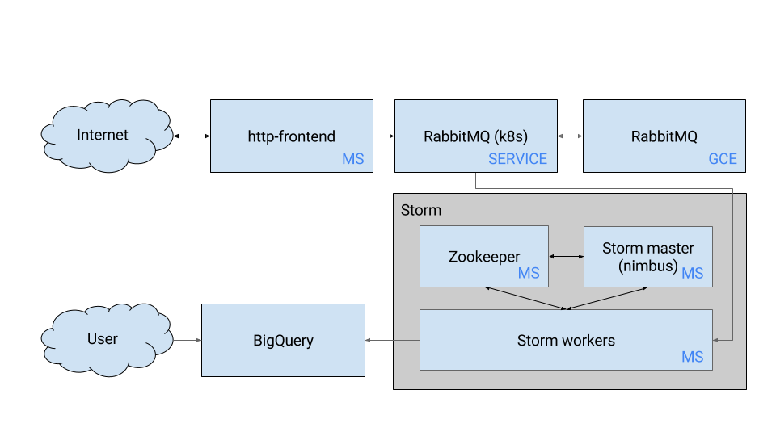

# Data processing Example
Welcome to the data processing example. It shows you how to deploy a data processing application using Deployment Manager.

## Prerequisites
### Deployment Manager
First, make sure DM is installed in your Kubernetes cluster by following the instructions in the top level
[README.md](../../README.md).

### Apache Storm
We assume you have Apache Storm installed.

### Google Cloud Resources
The data processing application will make use of several persistent disks and a BigQuery table, which we will host on Google Cloud. To create these resources we will create a deployment using Google Cloud Deployment Manager:

```
gcloud deployment-manager deployments create data-processing-resources --config data-processing-resources.yaml
```

where `data-processing-resources.yaml` looks as follows:

```
imports:
- path: data-processing-resources.jinja

resources:
- name: data-processing-resources
  type: data-processing-resources.jinja
  properties:
    project: <YOUR PROJECT>
    db-fields:
    - name: param1
      type: STRING
      mode: REQUIRED
    - name: param2
      type: STRING
      mode: NULLABLE
    - name: param3
      type: STRING
      mode: REQUIRED
```

and `data-processing-resources.jinja` looks as follows:

```









resources:
- name: {{ RABBITMQ_DISK_NAME }}
  type: compute.v1.disk
  properties:
    zone: us-central1-b
    sizeGb: {{ RABBITMQ_DISK_SIZE }}
- name: {{ DATASET }}
  type: bigquery.v2.dataset
  properties:
    datasetReference:
      projectId: {{ PROJECT }}
      datasetId: {{ DATASET }}
- name: {{ TABLE }}
  type: bigquery.v2.table
  properties:
    # Need to use a reference below so that the dataset gets created before the table
    datasetId: $(ref.{{ DATASET }}.datasetReference.datasetId)
    tableReference:
      projectId: {{ PROJECT }}
      datasetId: {{ DATASET }}
      tableId: {{ TABLE }}
    schema:
      fields: {{ DB_FIELDS }}
```

### Storm Topology
In `example/data-processing/storm-topology/src/jvm/storm/dataprocessing/DataProcessingTopology.java` you need to change the `PROJECT_ID` on line 78. You probably also need to change the IP address so that it points to your RabbitMQ service.

## Understanding the data processing example template
Let's take a closer look at the template used by the data processing example. The data processing application consists of 3 services: a http-frontend service, a RabbitMQ service (which can be running in Kubernetes or on a server somewhere else), and a Storm service which itself contains three microservices: a Zookeeper service, a Storm master service, and Storm workers. The architecture looks as follows:



### Variables
The template contains the following variables:

```




```

### Http-frontend service
The http-frontend service is a replicated service with 2 replicas:

```
- name: http-frontend
  type: https://raw.githubusercontent.com/kubernetes/deployment-manager/master/templates/replicatedservice/v2/replicatedservice.py
  properties:
    service_port: 80
    container_port: 80
    replicas: 2
    external_service: true
    image: gcr.io/dm-k8s-testing/http-frontend:latest
    env:
      - name: RABBITMQ_SERVER
        value: rabbitmq-service
      - name: RABBITMQ_USERNAME
        value: {{ RABBITMQ_USERNAME }}
      - name: RABBITMQ_PASSWORD
        value: {{ RABBITMQ_PASSWORD }}
```

The http-frontend image contains a simple Go service that accepts GET requests at `/send_data/` with the parameters `param1`, `param2`, `param3`. It then stores these messages in a RabbitMQ queue.

### RabbitMQ service
The RabbitMQ service either contains endpoints which point to an external RabbitMQ server or it points towards pods that are running inside Kubernetes.

```







resources:

- name: rabbitmq-service
  type: Service
  properties:
    kind: Service
    apiVersion: v1
    metadata:
      name: rabbitmq-service
    spec:
      ports:
      - protocol: TCP
        port: 5672
        targetPort: 5672
- name: rabbitmq-endpoints
  type: Endpoints
  properties:
    kind: Endpoints
    apiVersion: v1
    metadata:
      name: rabbitmq-service
    subsets:
      - addresses:
          
          - IP: {{ IP }}
          
        ports:
          - port: 5672

- name: rabbitmq
  type: https://raw.githubusercontent.com/kubernetes/deployment-manager/master/templates/replicatedservice/v2/replicatedservice.py
  properties:
    service_port: 5672
    container_port: 5672
    replicas: 1
    image: gcr.io/dm-k8s-testing/rabbitmq:latest
    env:
    - name: RABBITMQ_DEFAULT_USER
      value: {{ RABBITMQ_USERNAME }}
    - name: RABBITMQ_DEFAULT_PASS
      value: {{ RABBITMQ_PASSWORD }}
    volumes:
      - mount_path: /var/lib/rabbitmq/
        gcePersistentDisk:
          pdName: {{ RABBITMQ_DISK }}
          fsType: {{ RABBITMQ_FSTYPE }}

```

### Storm service
#### Zookeeper service
The Zookeeper service consists of a single replicated pod:

```
- name: zookeeper
  type: https://raw.githubusercontent.com/kubernetes/deployment-manager/master/templates/replicatedservice/v2/replicatedservice.py
  properties:
    service_name: zookeeper
    image: mattf/zookeeper
    service_port: 2181
    container_port: 2181
    replicas: 1
```

#### Storm nimbus/master service
The Storm nimbus/master service consits of a single replicated pod:

```
- name: storm-nimbus
  type: https://raw.githubusercontent.com/kubernetes/deployment-manager/master/templates/replicatedservice/v2/replicatedservice.py
  properties:
    service_name: nimbus
    service_port: 6627
    container_port: 6627
    replicas: 1
    external_service: true
    image: gcr.io/dm-k8s-testing/storm-nimbus:latest
```
#### Storm workers
The Storm worker pods are created by a single replication controller. Because of the way Storm defines its own cluster we do not need a service for the Storm workers. It looks as follows:

```
- name: storm-workers
  type: ReplicationController
  properties:
    kind: ReplicationController
    apiVersion: v1
    metadata:
      name: storm-worker-rc
      labels:
        name: storm-worker
    spec:
      replicas: 2
      selector:
        name: storm-worker
      template:
        metadata:
          labels:
            name: storm-worker
            uses: nimbus
        spec:
          containers:
            - name: storm-worker
              image: gcr.io/{{ PROJECT }}/storm-worker:latest
              ports:
                - hostPort: 6700
                  containerPort: 6700
                - hostPort: 6701
                  containerPort: 6701
                - hostPort: 6702
                  containerPort: 6702
                - hostPort: 6703
                  containerPort: 6703
              resources:
                limits:
                  cpu: 200m
```

#### Storm images
We use three Storm images, a common base image, a master/nimbus image, and a worker image. These images are similar to the images used in the [Kubernetes Storm example](https://github.com/kubernetes/kubernetes/tree/master/examples/storm). To allow Storm workers to connect to BigQuery we need to provide authentication, you can do this within GCE or you can supply a Google Application Credential file. We use the latter method, where we add a json file to the worker image. To run this example you need to generate a JSON key and save it in `image/storm-worker/google_application_credentials.json`. More information on how to generate a JSON key can be found [here](https://developers.google.com/identity/protocols/application-default-credentials#howtheywork).

## Deploying the data processing application
We can now deploy the data processing application using:

```
dm deploy examples/data-processing/data-processing.yaml
```

where `data-processing.yaml` looks as follows:

```
imports:
- path: data-processing.jinja

resources:
- name: data-processing
  type: data-processing.jinja
  properties:
    project: <YOUR PROJECT>
    rabbitmq:
      # Replace with your information
      username: rabbit
      password: rabbit-password
      # ips:
      # - <YOUR IP>
```

Once the application has been deployed we need to launch a Storm topology on it. First acquire the IP address of the Storm master: `kubectl describe service nimbus | grep LoadBalancer`, and then either add this IP address to your local Storm configuration (ie. Add the `storm.nimbus` property to `~/.storm/storm.yaml` with the IP address as value) or add the config property on every command (ie. `-c nimbus.host=<IP>`). We can then launch the Storm topology using `storm jar target/data-processing-0.9.5-jar-with-dependencies.jar storm.dataprocessing.DataProcessingTopology data-processing-topology`.
