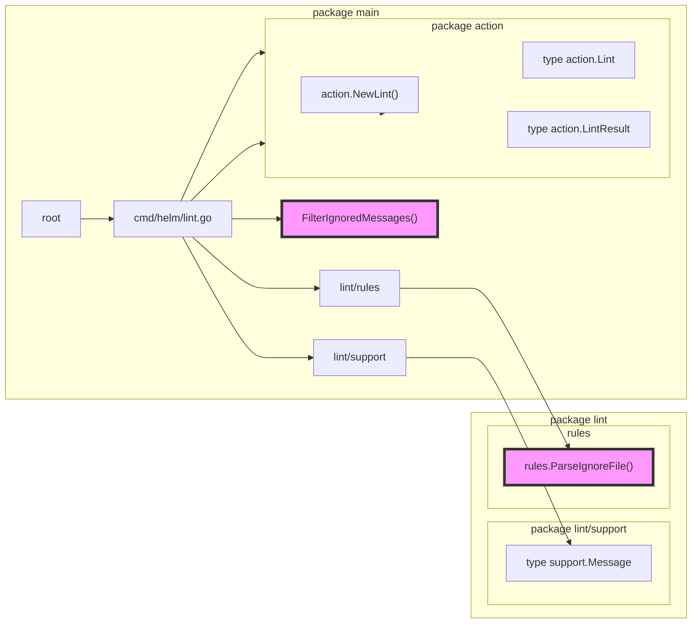

## HIP-0019 helm lint ignore file

### manual test

```bash
go run ./cmd/helm lint ~/repositories/gitlab/chart/ --lint-ignore-file ~/repositories/gitlab/chart/.helmlintignore --with-subcharts --debug
```

```
go run ./cmd/helm lint ../gitlab/chart/ --lint-ignore-file ../gitlab/chart/.helmlintignore --with-subcharts --debug
```

### code flow diagram

